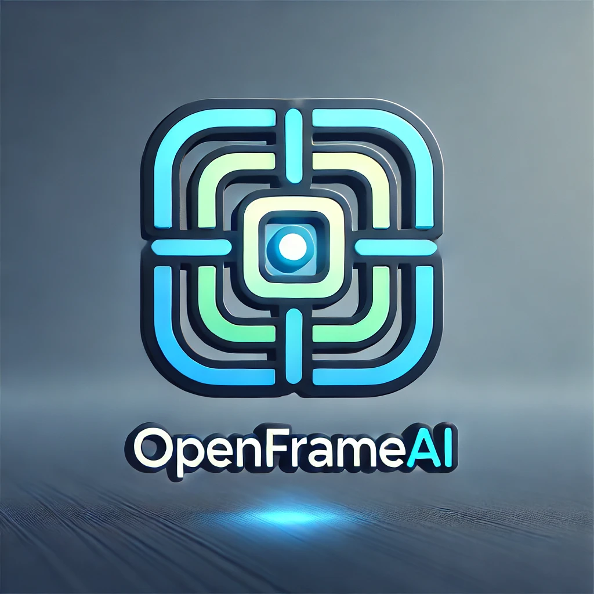

# OpenFrameAI
OpenFrameAI is a versatile, AI-powered platform designed to provide users with a 'wide canvas' to explore, create, and innovate. The platform converts UI designs into fully functional web applications with an intuitive interface, making it suitable for professionals, hobbyists, and organizations.
